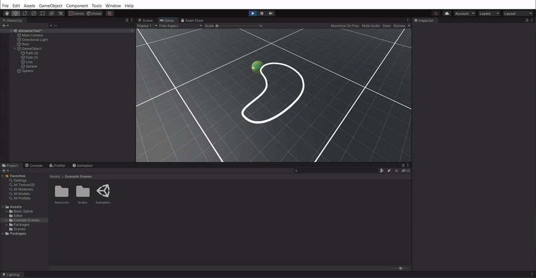

## Basic-Spline


An intuitive and lightweight path editor for Unity.

This package was built with two goals in mind. The first is to keep everything simple by keeping a clean UI and a simple API that only implements the basic spline functionality. The second goal is to implement analytical methods for curve sampling to avoid point caching.

# Features
* Simple, intuitive user interface.
* Using analytical methods for closest point finding and arc-length spline sampling without point caching.
* Multi-point selection, twist control, and scene geometry projection.
* Easy, intuitive API that offers a great range of flexibility.

Complete C# source code is provided.

# Usage

Clone the repo with submodules using the following command:
```
git clone --recurse-submodules https://github.com/Al-Asl/Basic-Spline.git
```
to create a path, go to `GameObject/Path/Path`. By coding, you can either use the `Path` class or the `Spline` class, the `Path` is a `MonoBehaviour` and it's only a wrapper for the `Spline` class.
```csharp
        //generating spline

        ControlPoint[] controlPoints = new ControlPoint[]
        {
            new ControlPoint(new Vector3(0,0,0),new Vector3(0,0,-1),new Vector3(0,0,1)),
            new ControlPoint(new Vector3(1,0,0),new Vector3(0,0,1),new Vector3(0,0,-1))
        };
        Spline spline = new Spline(controlPoints);

        //operating on control points

        spline.AddControlPoint(new ControlPoint(new Vector3(2, 1, -1), new Vector3(-1, 0, 0), new Vector3(1, 0, 0)));
        spline.InsertControlPoint(1, new ControlPoint(new Vector3(1, 1, 0), new Vector3(0, 0, 1), new Vector3(0, 0, -1)));
        spline.RemoveControlPoint(1);
        //shifting all points to the right
        for (int i = 0; i < spline.ControlPointsCount; i++)
        {
            var cpoint = spline.GetControlPoint(i);
            cpoint.Move(new Vector3(1, 0, 0));
            spline.SetControlPoint(i, cpoint);
        }

        //operating on segments
        foreach(var segment in spline.IterateSegments())
        {
            //Iterate over the segment points in fixed parametric steps.
            foreach (var point in segment.IteratePoints(30))
            {
                //do something with point ..
            }
        }
```

## sampling the curve using arc length
you can sample the curve by the arc length using `Spline.GetPoint`, 
you can also go from the arc length to the curve parameter or the other way around using `Segment.EvaluateParameter` and `Segment.EvaluateLength`.


* To approximate the arc length, this package uses [Approximate Arc Length Parametrization MARCELO WALTER ,AND ALAIN FOURNIER]
* I tried to find the inverse for arc length approximation, but the error margin was too big, so I stuck to root-finding on [Arc Length Approximation] using hybrid Newton's method.
* This package also implements other more accurate methods to find the arc length, such as different adaptive subdivision.

## finding the closest point
to get the closest point on the spline to the given point, use `Spline.GetClosestLength`. This method will return the arc length from the beginning of the spline to the closest point. You can use it with conjunction `Spline.GetPoint` to get the closest point.



* To find the closest point, this package uses [ Xiao-Diao Chen, Yin Zhou, Zhenyu Shu, Hua Su, Jean-Claude Paul. Improved Algebraic Algorithm On Point Projection For Bézier Curves. HAL, 2007 ]
* And for roots finding, it uses the hybrid Newton's method.